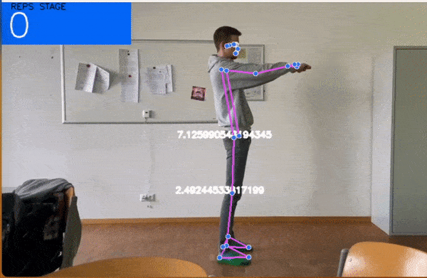

# ITP4-ZOG5a-2223

Übungen mit Kriterium das die Übung erfolgreich erfüllt ist.

-)Kniebeuge
    In der Anfangspose nehmen wir die Länge von Hintern zu Ferse.
    Anhand der y-Koordinate können wir die Länge berechnen.
    In der Übung soll der Hintern mindestens 43% dieser Länge zurücklegen.

-) Zähler
    Ein Zähler der mitzählt ,wenn die Übung richtig ausgeführt wurde.

-) Documentation
    Eine PowerPoint zu unserem Projekt ist unter CoachCzonka/doc zu finden.

# Squats

# Pushups

